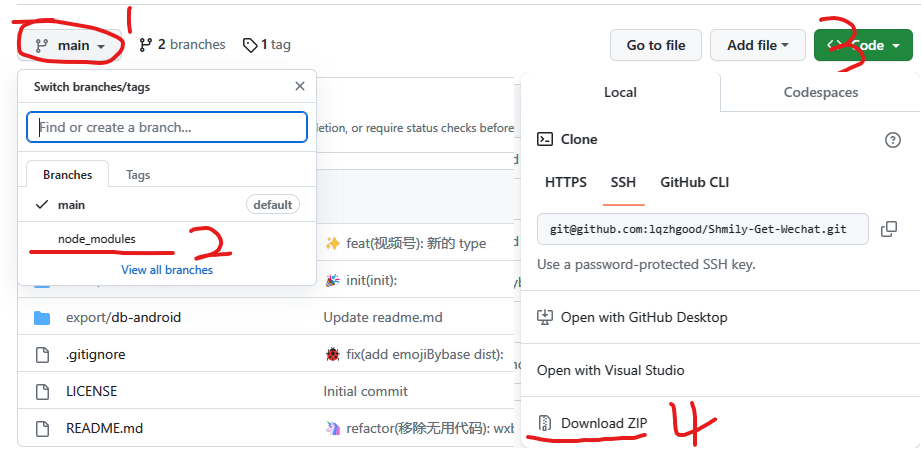

# 开始 Nodejs 项目

## 1. 安装 nodejs

-   查看 `package.json` 中 `engines` 字段获取项目所需 `nodejs` 版本
    -   如果没有 `engines` 字段，从官网 `https://nodejs.org/` 下载 `LTS` 版本
-   从 `https://nodejs.org/dist/` 下载相应版本的 `nodejs`
    -  Windows 平台注意事项
       -  请下载 `.msi` 后缀的标准安装程序(如 `node-v99.99.9-x64.msi`), 以下均不推荐
          -  `node-v99.9.9-win-x64.7z / node-v99.9.9-win-x64.zip` 为绿色版, 需要自己配置 `Path` 环境变量
          -  `./win-x64/node.exe` 为绿色单文件
-   安装过程，选项全部默认

## 2. 下载项目源代码

## 3. 安装项目依赖

下面提供 `从项目下载` 和 `从本地安装` 两种方式, 二选一即可

### 3.1 从项目下载 (建议)


<details>



可以查看项目是否有 `node_modules` 分支, 如果有, 可以直接下载其中的压缩包并解压到项目目录

```
// 解压后项目文件夹结构

-\
  - node_modules
    - .bin
    - ...
  - package.json
  - README.md
  - ...

```

</details>


### 3.2 从本地安装

<details>

<!--@include: ./snippets/open_cmd.md-->

-   执行命令安装依赖
    ```shell
    npm i
    ```
::: warning
如果安装以来过程中大量报错，特别是有 `node-gyp` 字样的，建议使用 [3.1 从项目下载] 的方式解决

其他的参考报错提示处理
:::


</details>

## 4. (可选)启动程序

项目一般会说明启动方式(`npm run xxxx`), 如果没有, 可以参考以下 


::: warning
项目启动方式并不唯一, 下面为常用的项目启动方式, 仅供参考
:::

-   按照项目说明启动程序

-   若项目无说明, 从 `package.json` 文件中的 `scripts` 字段获取执行脚本名称, 通过 `npm run {script}` 启动程序

    ```json
    {
        ...
        "scripts": {
            "dev": "vitepress dev docs",
            "build": "vitepress build docs",
            "serve": "vitepress serve docs"
        },
        ...
    }
    ```

    ::: info
    若 `script` 中有多个脚本名称(如上图), 一般来说，`build` 代表生产(正式)，`dev` 代表测试, 执行 `npm run build` 即可
    :::

-   若项目 `package.json` 中没有 `script` 字段, 则大多数情况下, `index.js` 为入口文件
    ```shell
        node index.js
    ```
