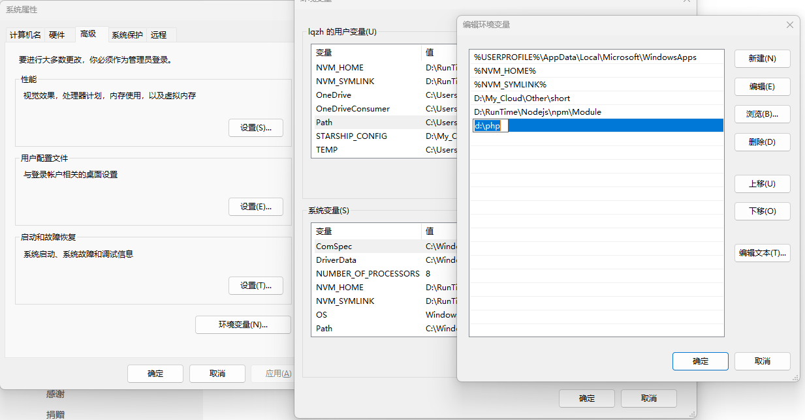

# 开始 PHP 项目

1. [官网](https://www.php.net/downloads) 下载 PHP
    > Windows 下载 VS16 x64 Thread Safe `.zip` 就行了
2. 解压 `.zip` 到 `D:\php`
3. 确认 `D:\php\php.exe` 存在
4. `开始` `运行` `sysdm.cpl`
5. 选择 `高级` `环境变量`
6. 选择 `Path`，新增一行 `D:\php`
7. 确认关闭窗口

