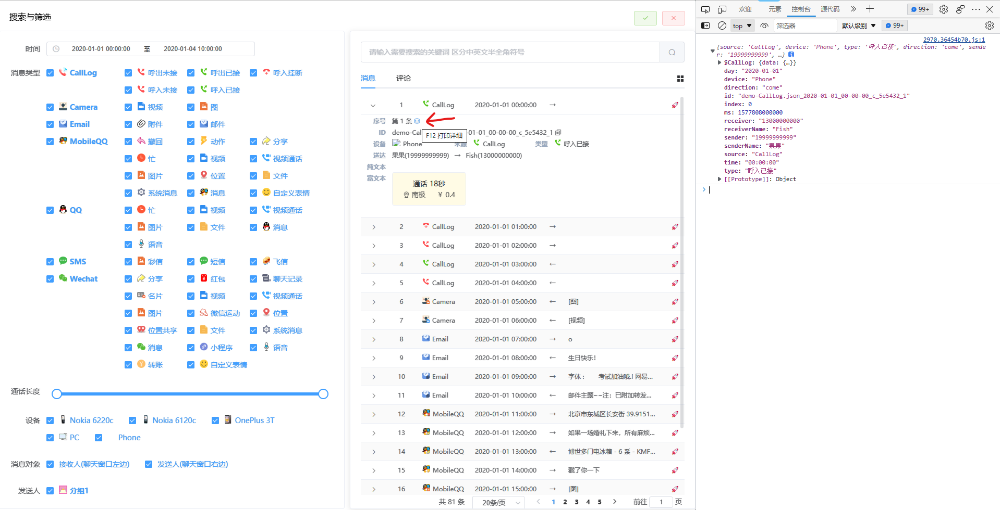

# 数据文件-Msg 示例

示例有以下三种查看方式

#### from JSON

<script setup>
import { onMounted, reactive, computed } from 'vue'
import _ from "lodash";
import   VueSelect from "vue-select";

onMounted(async () => {
     msgJson = await  fetch('http://demo.shmily.lqzh.me/json/msg/msg.json').then(d=>
    d.json()
    )
    const res = msgJson.reduce((pre, cV, cI, arr) => {
        // source
        let s = pre.find((v) => v.source === cV.source);
        if (!s) {
            s = {
                source: cV.source,
                type: [],
            };
            pre.push(s);
        }

        // type
        let t = s.type.find((v) => v.type === cV.type);
        if (!t) {
            t = {
                type: cV.type,
                os: [],
            };
            s.type.push(t);
        }

        // os
        const $Key = Object.keys(cV).find((k) => k.startsWith("$"));
        if ($Key) {
            let os = _.get(cV, `${$Key}.os`);
            if (os && !t.os.includes(os)) {
                t.os.push(os);
            }
        }

        return pre;
    }, []);
    menu.push(...res);
})

let msgJson = [];
const menu = reactive([]);
const f = reactive({source:'',type:'',os:''})
const json = computed(() => {
    if (!f.source || !f.type ) return [];

    const s = f.source.source;
    const t = f.type.type

    const res =  msgJson.filter(v=>v.source === s && v.type=== t)
    if (f.type.os.length ===0) return res;
    return res.filter(v=>v[`$${s}`].os === f.os)
})

function empty(m){
    if (m==='source'){
        f.type = '';
        f.os = ''
    }else if (m === 'type'){
        if (f.type.os.length ===1){
            f.os = f.type.os[0]
        }else{
            f.os = ''
        }
    }
}

</script>

<div id="msg-template">
    <div class="row">
        <div class="col">
            <label>source</label>
            <VueSelect :options="menu" label="source" v-model="f.source" @option:selected="empty('source')" />
        </div>
        <div class="col">
            <label>type</label>
            <VueSelect :options="f.source ? f.source.type : [] " label="type"  v-model="f.type" @option:selected="empty('type')" />
        </div>
        <div class="col" :class="{'disable': !f.type || f.type.os.length === 0} ">
            <label>$source.os</label>
            <VueSelect :options="f.type ? f.type.os : [] " v-model="f.os" />
        </div>
    </div>
</div>

```js-vue
{{json.slice(0, 1)}}
```

<style lang="sass">
@import "vue-select/dist/vue-select.css"

#msg-template
    .row
        width: 100%
        display: flex
        .col
            flex: 1 0 33%
            &.disable
                opacity: 0
</style>

### from Demo web

从 `Demo` [链接](http://demo.shmily.lqzh.me/#/query?searchType=消息&searchKey=-Reg:/*/) 筛选查看



### from 源码

在 [Shmily-Show](https://github.com/lqzhgood/Shmily-Show/) 项目 [memoryweb/src/components/Msg/source](https://github.com/lqzhgood/Shmily-Show/tree/main/memoryweb/src/components/Msg/source) 下查看组件源码
