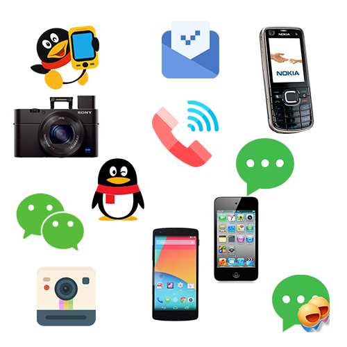
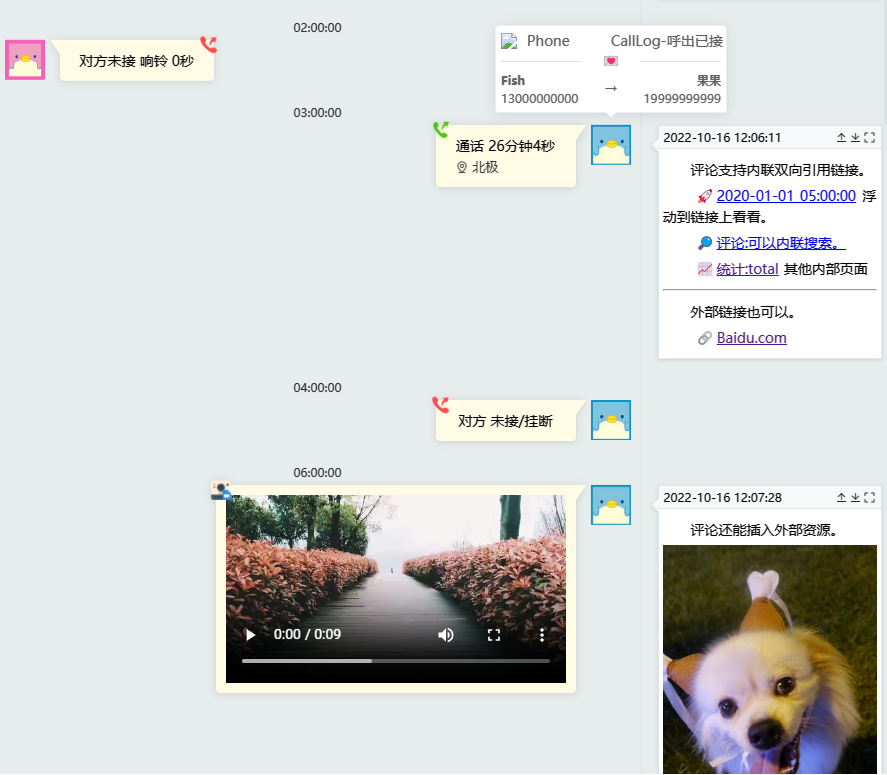

    

        

            

                <h2 class="title">类型多 平台全</h2>
                

                    
QQ、MobileQQ、微信、通话记录、短信、照片视频、Email等各种类型

                    
PC、Android、iOS 等各种平台

                    
* 甚至 Nokia Symbian S60v3 的 MobileQQ 和 短信都可以！

                

            

        

        

            
        

    

    

        

            

                <h2 class="title">以前导出的能合并</h2>
                

                    
支持将以前导出的数据和现在合并

                    
历史不再断代

                    
* 如2013年导出记录（2000-2013）可以 和2020年导出记录（2007-2020）合并 在同一时间线查看

                

            

        

        

            
        

    

    

        

            

                <h2 class="title">支持搜索和筛选</h2>
                

                    
关键词（支持正则）搜索

                    
时间、类型、设备、人物、通话时长等筛选

                    
* 搜索支持正则，人物支持分组

                    
* 极致优化，240M数据复杂搜索100ms内出结果

                

            

        

        

            
        

    

    

        

            

                <h2 class="title">还有评论和引用</h2>
                

                    
时间的长河有感而发？添加一条评论或打上一个Tag吧

                    
引用的消息也会转化为双向链接可快速跳转

                    
* 评论也可以搜索哦

                

            

        

        

            
        

    

    

        

            

                <h2 class="title">图表与统计</h2>
                

                    
不想看看各种维度的大数据么？

                    
纯表情回复的数量与对比都有哦！

                    
* 评论里的 Tag 也有统计，开心的次数不能少

                

            

        

        

            
        

    

    

        

            

                <h2 class="title">开发</h2>
                

                    
深入底层<a href="https://github.com/lqzhgood/Shmily-Show/blob/main/docs/Q_A.md" target="_blank">优化</a>，240M数据纯前端静态处理

                    
你还想要归档钉钉？导出（Get）、显示（Show）分离，你可以在任意阶段发力

                    
标准化、模块化、组件化，开发更容易

                    
数据字段全导出，总有你能用上的

                    
数据库导出、解密转换、合并清洗全过程解耦，拆开都是小轮子，自己的车装上就能跑

                

            

        

        

            
        

    

